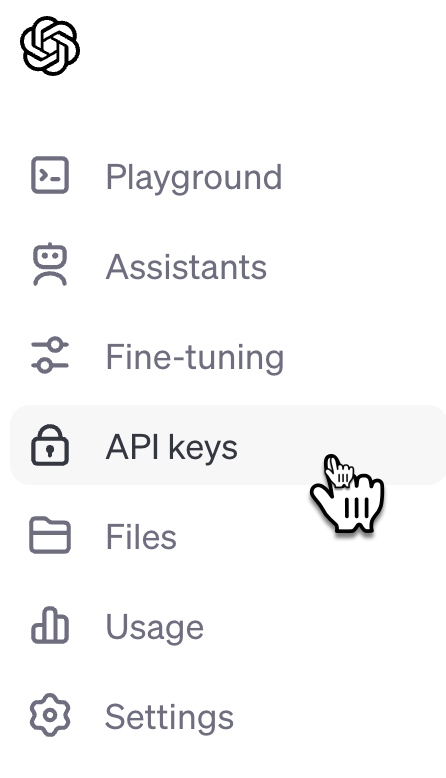

"Primi passi con OpenaAI e Nuvolaris MastroGPT"

Vediamo come iniziare una applicazione serveless che usa OpenAI.

Per accedere alle API di OpenAI occorre sottoscrivere un abbonamento.

A questo punto, occorre una chiave di accesso.

Una volta effettuato il login, selezioniamo quindi nel menù l'opzione API Keys.



Troverete quindi una opzione `Create a New Secret Key`. Cliccando il bottone,  
apparirà quindi un popup che vi chiederà il nome della chiave e vi permetterà di salvarlo nella clipboard.


A questo punto il posto migliore dove salvare la chiave è in una variabile di ambiente.

Com Mac e Linux, aprite un terminale e digitate:

```
echo OPENAI_API_KEY="<paste-the-api-key>" >>~/.bashrc
```

Se invece usate Windows, aprite PowerShell e digitate:

```
setx OPENAI_API_KEY "<paste-the-api-key>"
```

A questo punto occorre chiudere e riaprire il terminale.

Ora vediamo come creare una applicazione serverless che accede a questa API.

Occorre installare Nuvolaris e ottenere accesso ad un cluster Nuvolaris.

Se volete, potete chiederci un accesso gratuito al nostro ambiente di sviluppo, registrandovi nella waitlist di MastroGPT.com.
 
Una volta installato login a Nuvolaris potete creare un package che conterrà anche la vostra API KEY.


```
nuv package update sample \
 -p OPENAI_API_KEY $OPENAI_API_KEY
```

Adesso possiamo scrivere una semplice azione che dividiamo in due parti: nella prima parte ci colleghiamo ad OpenAI:

```
01 from  openai import OpenAI
02 def main(args):
03   ai = OpenAI(api_key=args['OPENAI_API_KEY'])
```

Qui notate in riga 1 che importiamo OpenAI, mentre in riga 3 ci connettiamo alla API.

Sempre in riga 3 usiamo gli argomenti che vengono passati in riga due, dove definiamo la funzione principale.

Adesso che abbiamo accesso ad OpenAI, vediamo se tutto funziona leggendo la lista dei modelli e ritornandola, come segue:

```
04   data = ai.models.list().model_dump()
05   models = [m['id'] for m in data['data']]
06  return { "models": models }
```

In linea 4 invochiamo la API chiedendo una lista dei modelli disponibili.  Ci viene ritornato un oggetto da cui estraiamo i soli nomi che ritornamo.

Adesso mettiamo tutto il codice nel file `models .py`, e creamo una azione:

```
nuv action update sample/models models.py
```

Infine proviamo ad invocare il tutto:

```
$ nuv invoke sample/models
{
    "models": [
        "dall-e-3",
        "gpt-3.5-turbo-0301",
        "whisper-1",
        "gpt-3.5-turbo-16k-0613",
        "gpt-3.5-turbo-16k",
        "gpt-3.5-turbo",
        ... omissis
    ]
}
```

E il vostro primo esempio con Nuvolaris è fatto!
