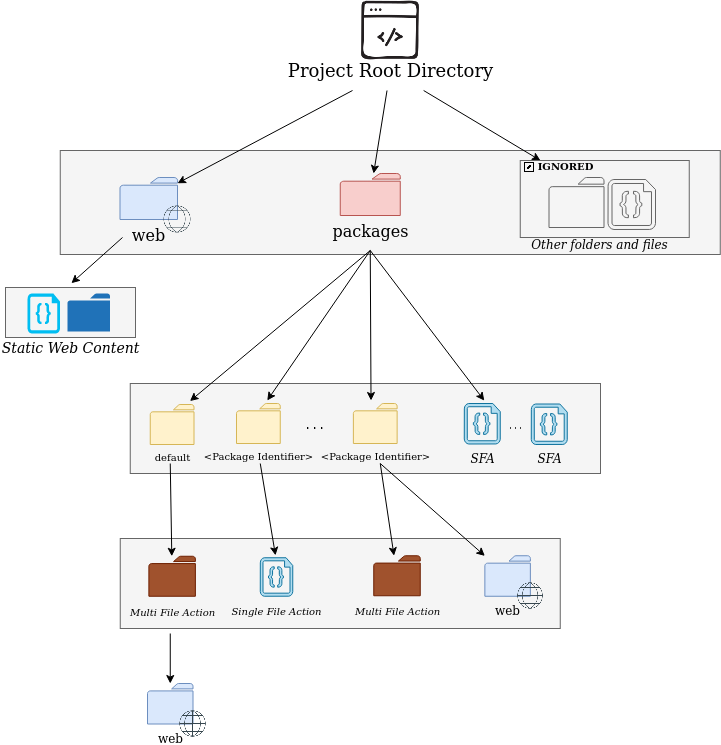

# A Nuvolaris Project

A project represents a logical unit of functionality whose boundaries are up to you. Your app can contain one or more projects. The folder structure of a project determines how the deployer finds and labels packages and actions, how it deploys static web content, and what it ignores.

You can detect and load entire projects into Nuvolaris with a single command using the `nuv` CLI tool.

# Project Detection

A project has a root folder, within which there can be 2 folders with special names:

- A `packages` folder: containes sub-folders which are treated as packages and are assumed to contain actions in the form of either files or folders, which we refer to as Single File Actions (SFA) and Multi File Actions (MFA).
- A `web` folder: contains folders and files with static web content.

Anything else is ignored. This lets you store things in the root folder that are not meant to be deployed on Nuvolaris (such as build folders and project documentation).



# The Deployer

You can use `nuv` to scan a folder and build a manifest file to deploy the project contained within, using `nuv -scan`.
It will scan the current folder (or the given path) looking for the folders named `packages` and `web`. 

## The packages folder

If the `packages` folder is found, `nuv` will proceed to build a manifest file where each sub-folder of `packages` is translated to a package creation command (1 package for each subfolder) and each files in this level is considered
to create a Single File Action under the `default` package which is pre-created in every Nuvolaris deployment.

In every sub-folder, if it finds files it will generate a command to create [single file actions](#single-file-actions)
in the package corresponding to the sub-folder's name. If it finds sub-folders, it will generate commands to create [multi file actions](#multi-file-actions). There can be the special `web` sub-folder which will be used to deploy a static frontend under the relative package name, so in this case it is not a MFA.

### Single File Actions

A single file actions is simply a file with an extension (the supported ones: `.js`  `.py` `.go` `.java`)

This will cause the generation of a `action create` command with `--kind nodejs:default`, `--kind python:default`, `--kind go:default` and `--kind java:default` using the correct runtime.

The correct runtime is described by `runtime.json` that can be downloaded from the configured api host.

If the extension is in format:  `.<version>.<extension>`, the command will have `--kind <language>:<version>`


### Multi File Actions

`nuv` implements some heuristics to decide the correct type of the file to build.

Currently:

- if there is a `package.json`  or any `js` field in the folder then it is  `.js` and it builds with `npm install ; npm build`
- if there is a `requirements.txt` or any `.py` file then it is python and it builds creating a virtual env as described in the python runtime documentation
- if there is `pom.xml` then it builds using `mvn install`
- if there is a `go.mod` then it builds using `go build`

The command that `nuv` will generate consists of i) zip the folder ii) create the action with the zip archive and the correct type of the runtime.

# Static frontend

The `web` folder in the root of a project is used to deploy static frontends. A static front-end is a collection of static asset under a given folder that will be published in a web server under a path.

The path that will serve the a static asset is determined by:
- Hostname
- Location of the asset

## Hostname

In general, for each namespace there will be a `https://<namespace>.<domain>` website where to publish the resources. For the local deployment there will be a website `http://127.0.0.1:8080` where the resources are published, with the namespace and the domain ignored.

## Path detection

The path where the assets are published depends on the path in the `web` hierarchy.

The sub-folder `web` is published as "/".

Any subfolder `web` under `packages/<package>/web` is published under `/<packages>/`.

Any subfolder `web` under `packages/default/<action>\web` is published as `/<action>`.

Any subfolder `web` under `packages/<package>/<action>/web` is published as `/<package>/<action>`

What is published (files collected) and how it is built is defined by the next paragraph.

## Building and Collecting

In every folder `web` it will check if there is a `nuvolaris.json`

If there is not a `nuvolaris.json` and not a `package.json` it will assume this base `nuvolaris.json`:

```
{
  "collect": ".",
  "install": "echo nothing to install",
  "build": "echo nothing to build"
}
```

If instead there is `packages.json`, it will assume this base `nuvolaris.json`:

```
{
  "collect": "public",
  "install": "npm install",
  "build": "npm run build"
}
```

The it will read the `nuvolaris.json` replacing the keys in it with the default ones.

The generated taskfile will execute at deployment step:

- the command defined by `install` only if there is not a `node_modules`
- the command defined by `build` always
- then it will collect for publishing (creating a crd instance) the files in the folder defined by `collect`

It is recommended that `nuv scan` does not execute directy the command but instead it delegates to another command like `nuv build` and in turn the creation of `crd` to another `nuv crd` subcommand, after changing to the corresponding sudfolder. All those commands should work by default in current folder. 


# The Complete Mapping

To summarize, the mapping for packages is:

| Folder Name | Nuvolaris Package | Type |
| --- | --- | --- |
| Root directory |  |  |
| packages |  |  |
| packages/&lt;package_name&gt; | &lt;package_name&gt; | Nuvolaris Package |
| &lt;file_name&gt; | default | Single File Action |
| packages/&lt;package_name&gt;/&lt;file_name&gt; | &lt;package_name&gt; | Single File Action |
| packages/&lt;package_name&gt;/&lt;subfolder_name&gt; | &lt;package_name&gt; | Multi File Action |

And the mapping for web folders is:

| Folder Name | Endpoint |
| --- | --- | 
| Root directory |  |  
| web | `/` | 
| packages/&lt;package_name&gt;/web | `/<package_name>/` |
| packages/&lt;default&gt;/&lt;action_name&gt;/web | `packages/default/<action_name>\web` |
| packages/&lt;package_name&gt;/&lt;action_name&gt;web | `/<package>/<action>` |