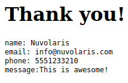

== Form Validation and Submission

Now that we have a contact form and a package for our actions, we have to handle the submission. We can do that by adding a new action that will be called when the form is submitted. Let's create a `submit.js` file in our `packages/contact` folder.

[source,javascript]
----
function main(args) {
  let message = []
  let errors = []
  // TODO: Form Validation
  // TODO: Returning the Result
}
----

This action is a bit more complex. It takes the input object (called args) which will contain the form data (accessible via `args.name`, `args.email`, etc.). With that. we will do some validation and then return the result.

=== Form Validation

Let's start filling out the "Form Validation" part by checking the name:

[source,javascript]
----
// validate the name
if(args.name) {
 message.push("name: "+args.name)
} else {
 errors.push("No name provided")
}
----

Then the email by using a regular expression:
[source,javascript]
----
// validate the email
var re = /\S+@\S+\.\S+/;
if(args.email && re.test(args.email)) {
   message.push("email: "+args.email)
} else {
  errors.push("Email missing or incorrect.")
}
----

The phone, by checking that it's at least 10 digits:
[source,javascript]
----
// validate the phone
if(args.phone && args.phone.match(/\d/g).length >= 10) {
  message.push("phone: "+args.phone)
} else {
  errors.push("Phone number missing or incorrect.")
}
----

Finally, the message text, if present:
[source,javascript]
----
// validate the message
if(args.message) {
  message.push("message:" +args.message)
}
----

=== Validation Done, Return the Result

With the validation phase, we added to the "errors" array all the errors we found, and to the "message" array all the data we want to show to the user. So if there are errors, we have to show them, otherwise, we store the message and return a "thank you" page.

[source,javascript]
----
// return the result
if(errors.length) {
  var errs = "<ul><li>"+errors.join("</li><li>")+"</li></ul>"
  return {
    body: "<h1>Errors!</h1>"+
      errs + ' <a href="javascript:window.history.back()">Back</a>'
   }
} else {
   var data = "<pre>"+message.join("\n")+"</pre>"
   return {
      body: "<h1>Thank you!</h1>"+ data,
      name: args.name,
      email: args.email,
      phone: args.phone,
      message: args.message
   }
}
----

Note how this action is returning HTML code. Actions can return a `{ body: <html> }` kind of response and have their own url so they can be invoked via a browser and display some content. 

The HTML code to display is always returned in the `body` field, but we can also return other stuff. In this case we added a a field for each of the form fields. This gives us the possibility to invoke in a sequence another action that can act just on those fields to store the data in the database.

Let's start deploying the action:

[source,bash]
----
nuv action create contact/submit submit.js --web true
ok: created action contact/submit
----

The `--web true` specifies it is a web action. We are creating a `submit` action in the `contact` package, that's why we are passing `contact/submit`.

You can retrieve the url with:

[source,bash]
----
nuv url contact/submit

$ <apihost>/api/v1/web/nuvolaris/contact/submit
----

If you click on it you will see the Error page with a list of errors, that's because we just invoked the submit logic for the contact form directly, without passing in any args. This is meant to be used via the contact form page!

We need to wire it into the index.html. So let's open it again and add a couple of attributes to the form:

[source,html]
----
---             <form method="POST"> <-- old
+++            <form method="POST" action="/api/v1/web/nuvolaris/contact/submit"
               enctype="application/x-www-form-urlencoded"> <-- new
----

Upload the web folder again with the new changes:

[source,bash]
----
nuv web upload web/
----

Now if you go to the contact form page the send button should work. It will invoke the submit action which in turn will return some html. 

If you fill it corectly, you should see the "Thank you" page.

Note how only the HTML from the `body` field is displayed, the other fields are ignored in this case.

====

The `nuv action` command can be used for many more things besides creating actions. For example, you can use it to list all available actions:

[source,bash]
----
nuv action list

actions
/nuvolaris/contact/submit               private nodejs:18
---- 

And you can also get info on a specific action:

[source,bash]
----
nuv action get contact/submit

{
    "namespace": "nuvolaris/contact",
    "name": "submit",
    "version": "0.0.1",
    "exec": {
        "kind": "nodejs:18",
        "binary": false
    },
 ...
}
----

These commands can come in handy when you need to debug your actions.
====

Here is the complete the `submit.js` action:

[source,javascript]
----
function main(args) {
  let message = []
  let errors = []

  // validate the name
  if (args.name) {
    message.push("name: " + args.name)
  } else {
    errors.push("No name provided")
  }

  // validate the email
  var re = /\S+@\S+\.\S+/;
  if (args.email && re.test(args.email)) {
    message.push("email: " + args.email)
  } else {
    errors.push("Email missing or incorrect.")
  }

  // validate the phone
  if (args.phone && args.phone.match(/\d/g).length >= 10) {
    message.push("phone: " + args.phone)
  } else {
    errors.push("Phone number missing or incorrect.")
  }

  // validate the message
  if (args.message) {
    message.push("message:" + args.message)
  }

  // return the result
  if (errors.length) {
    var errs = "<ul><li>" + errors.join("</li><li>") + "</li></ul>"
    return {
      body: "<h1>Errors!</h1>" +
        errs + ' <a href="javascript:window.history.back()">Back</a>'
    }
  } else {
    var data = "<pre>" + message.join("\n") + "</pre>"
    return {
      body: "<h1>Thank you!</h1>" + data,
      name: args.name,
      email: args.email,
      phone: args.phone,
      message: args.message
    }
  }
}
----