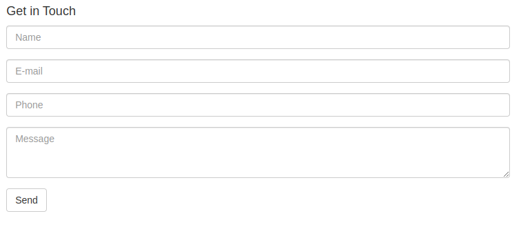

= Tutorial

This tutorial walks you through developing a simple Nuvolaris application 
using the Command Line Interface (CLI) and Javascript (but any supported language will do).

Its purpose is to showcase serverless development in action by creating a contact form for a website.
We will see the development process from start to finish, including the deploying of the platform and running the application.

== Getting Started

Imagine we have a static website and need server logic to store contacts 
and validate data. This would require a server, a database and
some code to glue it all together. With a serverless approach we can
just sprinkle little functions (that we call actions) on top of our static website and let Nuvolaris 
take care of the rest. No more setting up VMs, backend web servers, databases, etc.

=== Nuvolaris CLI: Nuv

Serverless development is mostly performed on the CLI, and Nuvolaris has 
it's own tool called "nuv". It's a command line tool that allows you to
deploy (and interact with) the platform seamlessly to the cloud, locally and custom environments.

Nuv is cross-platform and can be installed on Windows, Linux and MacOS. You can find 
it here: https://github.com/nuvolaris/nuv/releases[Nuv Releases]

=== Deploy Nuvolaris Locally

To start using Nuvolaris we can easily setup a local deployment consisting of a Kubernetes cluster and Nuvolaris. This 
will give us a ready to use serverless environment. We also want to enable an extra service: a Postgres database, because we will use it later. Let's run in the terminal:

[source,bash]
----
nuv config enable --postgres
----

If it's the first time you use the nuv tool, it will ask you to download the tasks. In this case just run:

[source,bash]
----
nuv -update
----

Then re-run the config command. This will enable the extra services.

Now just run:

[source,bash]
----
nuv setup devcluster
----

And with just that (when it finishes), we have a serverless platform ready to use!

== Nuvolaris First Steps
=== Create the Contact Package 

The nuv tool embeds `wsk` (the OpenWhisk CLI) so we can use it to interact with the platform the same way we would with vanilla OpenWhisk. 
The first step we can make is to create a new package to hold our actions, furthermore we can bind to this package the database url, so the actions can directly access it!

Use the debug subcommand to see what's going on and grab the "postgres_url" value:

[source,bash]
----
nuv debug config
----

Copy the postgres url and now we can create a new package for the application:

[source,bash]
----
nuv -wsk package create contact -p dbUri <postgres_url>
ok: created package contact
----

The actions under this package will be able to access the "dbUri" variable from the args! 

=== Our First Action: the Contact Form

In Nuvolaris, actions can just return html and they can even act as web pages. These are called "web actions".
Let's create a simple action that returns the contact form html:

[source,javascript]
----
function main() {
    return {
        body: `<html><head>
<link href="//maxcdn.bootstrapcdn.com/bootstrap/3.3.0/css/bootstrap.min.css"
      rel="stylesheet" id="bootstrap-css">
</head><body>
 

  

   

    <h4>Get in Touch</h4>
    <form method="POST" action="submit">
     

       <input type="text" name="name"
        class="form-control" placeholder="Name">
     

     

        <input type="email" name="email"
         class="form-control" placeholder="E-mail">
     

     

        <input type="tel" name="phone"
         class="form-control" placeholder="Phone">
     

     

        <textarea  name="message" rows="3"
         class="form-control" placeholder="Message"
         ></textarea>
      

      <button class="btn btn-default" type="submit" name="button">
        Send
      </button>
    </form>
   

  

 

</body></html>`
    }
}
----

Note that the action is just a function called `main` that returns an object and optionally can have an object in input (not used in this case).
Save the code in a file called `form.js`.

Let's deploy it in the platform:

[source,bash]
----
nuv -wsk action create contact/form form.js --web true
ok: created action contact/form
----

We are uploading the action into Nuvolaris under `contact/form` where `contact` is the package name we just created and `form` the action name.
The `--web true` flag tells Nuvolaris that this action is a web action, so it will be accessible via http. To do that, we have to get its url which was 
automatically associated to the action (the url might be different in your case):

[source,bash]
----
nuv -wsk action get contact/form --url
ok: got action contact/form
http://localhost:3233/api/v1/web/nuvolaris/contact/form
----

Let's open the url in the browser!

=== Form Validation and Submission

Now that we have a contact form, we have to handle the submission. We can do that by adding a new action that will be called when the form is submitted. Let's create a `submit.js` file.

[source,javascript]
----
function main(args) {
  let message = []
  let errors = []
  // TODO: Form Validation
  // TODO: Returning the Result
}
----

This action is a bit more complex. It takes the input object (called args) which will contain the form data (accessible via `args.name`, `args.email`, etc.). With that we will do some validation and then return the result.

==== Form Validation

Let's start filling the "Form Validation" part by checking the name:

[source,javascript]
----
// validate the name
if(args.name) {
 message.push("name: "+args.name)
} else {
 errors.push("No name provided")
}
----

Then the email by using a regular expression:
[source,javascript]
----
// validate the email
var re = /\S+@\S+\.\S+/;
if(args.email && re.test(args.email)) {
   message.push("email: "+args.email)
} else {
  errors.push("Email missing or incorrect.")
}
----

The phone, by checking that it's at least 10 digits:
[source,javascript]
----
// validate the phone
if(args.phone && args.phone.match(/\d/g).length >= 10) {
  message.push("phone: "+args.phone)
} else {
  errors.push("Phone number missing or incorrect.")
}
----

Finally the message text, if present:
[source,javascript]
----
// validate the message
if(args.message) {
  message.push("message:" +args.message)
}
----

==== Validation Done, Return the Result

With the validation phase, we added to the "errors" array all the errors we found, and to the "message" array all the data we want to show to the user. So if there are errors, we have to show them, otherwise we store the message and return a "thank you" page.

[source,javascript]
----
if(errors.length) {
  var errs = "<ul><li>"+errors.join("</li><li>")+"</li></ul>"
  return {
    body: "<h1>Errors!</h1>"+
      data + errs +
      ' <a href="javascript:window.history.back()">Back</a>'
   }
} else {
   var data = "<pre>"+message.join("\n")+"</pre>"
   // storing in the database
   // TODO: <Store the message in the database> 
   return {
     body: "<h1>Thank you!</h1>"+ data
   }
}
----

The code is not yet complete, but let's start deploying it:

[source,bash]
----
nuv -wsk action create contact/submit submit.js --web true
ok: created action contact/submit
----

Now if you go to the contact form page and submit it correctly, you should see the "Thank you" page.

image::../images/submit.png["Submit Result",align="center"]

Almost like magic, the submit action is automatically triggered by the form submit button with the right data.

=== Storing the Message in the Database

Now we are ready to use the database that we enabled at the beginning of the tutorial. 
Since we are using a relational database, we need to create a table to store the contact data. We can do that by creating a new action called `create-table.js`:

[source,javascript]
----
const { Client } = require('pg')

async function main(args) {
    const client = new Client({ connectionString: args.dbUri });

    const createTable = `
    CREATE TABLE IF NOT EXISTS contacts (
        id UUID PRIMARY KEY,
        name varchar(50),
        email varchar(50),
        phone varchar(50),
        message varchar(300)
    );
    `
    // Connect to database server
    await client.connect();

    try {
        await client.query(createTable)
    } catch (e) {
        console.log(e);
        throw e
    } finally {
        client.end();
    }
}
----

We just need to run this once and it does not need to be a web action. We can deploy it with:

[source,bash]
----
nuv -wsk action create contact/create-table create-table.js
ok: created action contact/create-table
----

Now we run it:

[source,bash]
----
nuv -wsk action invoke contact/create-table -r
{}
----

This time we invoked the action manually with `-r` to get the result, which is an empty object because the action does not return anything.

==== The Action to Store the Data

We could just write the code to insert data into the table in the `submit.js` action, but it's better to have a separate action for that. Let's create a new action called `write.js`:

[source,javascript]
----
const { Client } = require('pg')

async function main(args) {
    const client = new Client({ connectionString: args.dbUri });

    // Connect to database server
    await client.connect();

    const { name, email, phone, message } = args

    try {
        await client.query(
            'INSERT INTO nuvolaris_table(name,email,phone,message) VALUES($1,$2,$3,$4)',
            [name, email, phone, message]
        )
    } catch (e) {
        console.log(e);
        throw e
    } finally {
        client.end();
    }
}
----

Very similar to the create table action, but this time we are inserting data into the table by passing the values as parameters. Let's deploy it:

[source,bash]
----
nuv -wsk action create contact/write write.js
ok: created action contact/write
----

=== Finalizing the Submit Action

Alright, we are almost done. We just need to add the code to invoke the `write` action to store the data. We can do that by adding a small function
inside the `submit.js` action:

[source,javascript]
----
var openwhisk = require('openwhisk')

function save(doc) {
  var ow = openwhisk({api_key: "25cdfc80-1e9f-4863-9162-42e8d6ae11c6:0ESe6byS0fD8xi93OIZGeIHFb0siACR1d6OtjLfEeLzEFaWJ8ArddHzsiII8MHMO"})
  return ow.actions.invoke({
    "name": "contact/write",
    "params": {
      "name": doc.name,
      "email": doc.email,
      "phone": doc.phone,
      "message": doc.message
    }
  })
}
...
----

Add that above the `main` function! What we are doing here is to 
import the special `openwhisk` module that gives you access to the Openwhisk 
API (the Nuvolaris' serverless engine) from within any action. To construct 
the `ow` object we need to pass the API key, which you can get with

[source,bash]
----
nuv -wsk property get --auth
ok: whisk auth get
----

If you are using the default user, the key should be the same as the one in the code above.

Now we can replace that last TODO with a call to the `save` function:

[source,javascript]
----
save({
      "name": args.name,
      "email": args.email,
      "phone": args.phone,
      "message": args.message
    })
----

Let's update the action:

[source,bash]
----
nuv -wsk action update contact/submit submit.js --web true
ok: updated action contact/submit
----

Now the pipeline is complete, and we can test it by submitting the form again. This time the data will be stored in the database.

=== Sending an Email

Now let's add a feature that shows how the system interacts with other systems. We will set up the system to send an email when someone uses our contact form (for both complete and incomplete submissions).

We are going to use the https://sendgrid.com[SendGrid] service to send the email. 
First, we need to create a Sendgrid account and get an API key in the Settings->ApiKeys menu. Just go on the SendGrid homepage and follow the signup process, once you are in
you have to create a "Sender" account and finally go on the Api Keys page and create one.

Then we can proceed to create a new action called `send-email.js`.

[source,javascript]
----
async function main(args) {
    let res = await fetch("https://api.sendgrid.com/v3/mail/send", {
        method: "POST",
        headers: {
            'Content-Type': 'application/json',
            'Authorization': 'Bearer ' + args.sendgrid
        },
        body: JSON.stringify({
            "from": { "email": args.from },
            "subject": "[Contact Form]",
            "personalizations": [
                { "to": [{ "email": args.to }] }
            ],
            "content": [
                { "type": "text/plain", "value": args.body }
            ]
        })
    })
    return { body: { ok: res.ok } }
}
----

This action uses 4 parameters, the `args.sendgrid` which is the api key. The `args.from` and `args.to`, the sender and recipient, and finally `args.body` which is the content. This last one will be the body returned from the submit action.

Let's first set up the action:

[source,bash]
----
SENDGRID="<put your api key>"
FROM=<your autorized sender>
TO=<your destitation>

nuv -wsk action create contact/sendemail send-email.js -p sendgrid $SENDGRID -p from $FROM -p to $TO --web=true
----

We are already setting the first 3 parameters, the last one is given in input by 
the submit action at every invocation.

==== Creating the Action Sequence

We have developed an action that can send an email as a standalone action, but we designed it to take the output of the submit action and return it as is so we can create a pipeline of actions, where the output of a command is used as an input for another command.

Note that it will send emails for every submission, even for incorrect inputs, so we will know if someone is trying to use the form without providing all the information. But we will only store the fully validated data in the database. 

Let's create this pipeline, called a sequence, and then test it:

[source,bash]
----
nuv -wsk action create contact/submit-sendemail --sequence contact/submit,contact/sendemail --web true
ok: created action contact/submit-sendemail
----

Now to start using this sequence, instead of just the submit action, we need to update the `form.js` action to invoke the new sequence:

[source,html]
----
--- <form method="POST" action="submit">
+++ <form method="POST" action="submit-sendmail">
----

[source,bash]
----
nuv -wsk action update contact/form form.js --web true
ok: updated action contact/form
----

Now try to fill the form again and press send! It will execute the sequence and you will receive the email on your email account that you used
in sendgrid.

== Cleaning Up

Once you are done experimenting and want to tear everything down, just run:

[source,bash]
----
nuv setup devcluster --uninstall
nuv config disable --postgres
----

This will remove Nuvolaris and the local cluster, and disable the postgres database that we enabled earlier.

Checkout the other tutorials to learn how to build more complex applications with Nuvolaris!